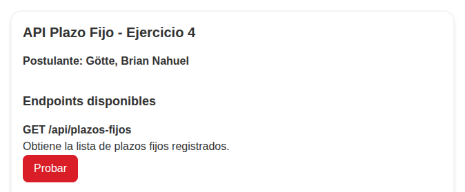
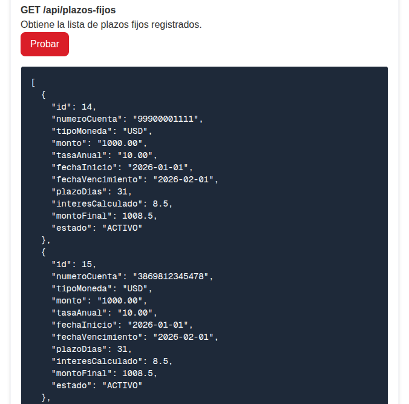
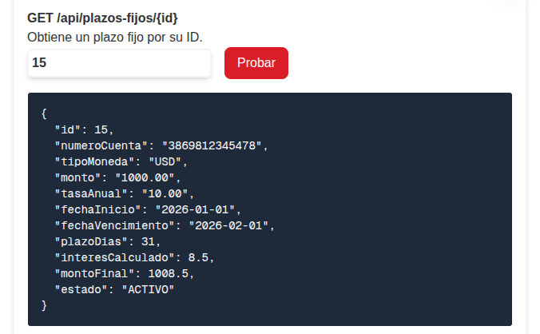
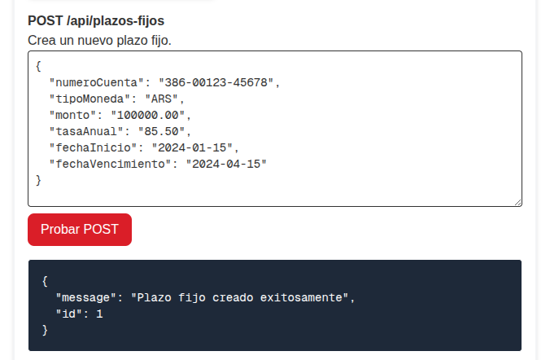
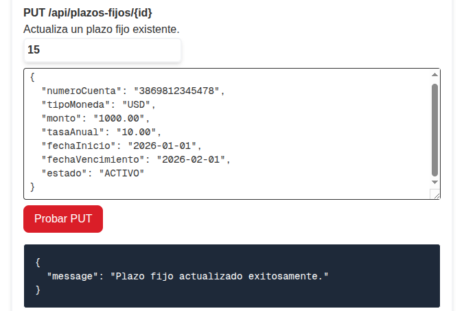
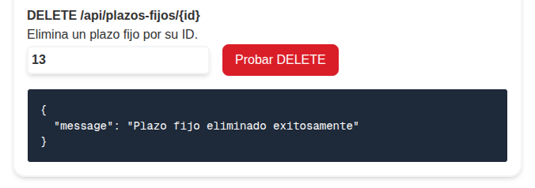

# Manual de Usuario

El sistema implementa la funcionalidad principal para gestionar los plazos fijos a través de una API REST, así como una interfaz web básica diseñada para facilitar la interacción directa con los endpoints expuestos.

## Acceso al Sistema

Debe desplegar la aplicación mediante Docker para acceder al sistema. (Véase [Guía de Instalación](./1-GUIA_INSTALACION.md)). Realizado esto, abra su navegador web favorito e ingrese a la siguiente dirección:

**URL de acceso:** `http://localhost:3000/`

## Plazos fijos

El sistema permite la creación de plazos fijos y su posterior manipulación y obtención. Requiere que la entidad que haga uso de la misma, envíe la siguiente información para la creación del plazo fijo:
* **Número de cuenta**: identificador de la cuenta bancaria del usuario o entidad que está realizando el plazo fijo. 
* **Tipo de moneda**: el código de la divisa escrito en estándar ISO 4217. Por defecto, se aceptan únicamente Pesos Argentinos (ARS) y Dólares Estadounidenses (USD)
* **Monto**: el total de dinero que se deposita en plazo fijo.
* **Tasa Anual**: el porcentaje que se ha ofrecido de interés sobre el capital.
* **Fecha de inicio**: el día en que se realiza el plazo fijo, y desde el cual se comienza a computar el interés.
* **Fecha de vencimiento**: el día en que el plazo fijo vence.

Estos datos se deben brindar a la API en un formato JSON específico. Véase [documentación de la API](./3-DOCUMENTACION_API.md).

Se aplican ciertas restricciones sobre los datos, estas son:
* El monto debe ser mayor a cero.
* El código de la moneda debe existir en el sistema.
* Las cuentas están asociadas a una moneda, por lo que no se permite ingresar un plazo fijo utilizando otra moneda distinta a la de la cuenta.
* La tasa anual debe encontrarse entre el 1% y el 200%, ambos extremos inclusive.
* La fecha de vencimiento debe ser posterior a la fecha de inicio del plazo fijo, y no puede exceder los 365 días.
* El estado por defecto al ingresar un plazo fijo es "ACTIVO". Puede modificarse luego de ingresado por los siguientes valores: VENCIDO, CANCELADO, RENOVADO.


## Uso del panel de interacción (Frontend)

La pantalla principal actúa como un cliente HTTP integrado. Encontrará secciones divididas por cada operación disponible en la [API](./3-DOCUMENTACION_API.md)

Puede utilizar otras aplicaciones, como Postman, para realizar peticiones de prueba. 

### 1. Obtener Plazos Fijos (GET)
Implementa la petición `HTTP GET /api/plazos-fijos`. Se obtendrá como respuesta el listado de los plazos fijos en el caso que se encuentren registros ingresados, con sus correspondientes datos.
Para utilizar esta funcionalidad, presione el botón "Probar" de color rojo.



La respuesta esperada de este endpoint se especifica en la [documentación de la API](./3-DOCUMENTACION_API.md#1-obtener-todos-los-plazos-fijos). Se mostrará el JSON del resultado de la consulta en un recuadro justo debajo del botón:



### 2. Obtener Plazo Fijo por ID (GET)
Implementa la petición `HTTP GET /api/plazos-fijos/{id}`. Se obtendrá como respuesta el listado de los plazos fijos en el caso que se encuentren registros ingresados, con sus correspondientes datos.
Para utilizar esta funcionalidad, ingrese en el campo de texto el id numérico del registro que desea consultar, y presione el botón "Probar" de color rojo. Se mostrará la [respuesta](./3-DOCUMENTACION_API.md#2-obtener-plazo-fijo-por-id) en un recuadro siguiente al botón.



### 3. Creación de un Plazo Fijo (POST)
En la sección `POST`, el sistema le provee una plantilla JSON por defecto en el área de texto, disponible para modificar con los datos que se desea ingresar. La plantilla tiene el siguiente formato:
```json
{
  "numeroCuenta": "",
  "tipoMoneda": "",
  "monto": "",
  "tasaAnual": "",
  "fechaInicio": "",
  "fechaVencimiento": ""
}
```
Debe rellenar cada uno de los campos con los datos pertinentes, cumpliendo con lo requerido por la [API](./3-DOCUMENTACION_API.md#3-crear-un-plazo-fijo). Recuerde que debe utilizar comillas dobles para cada dato.
Una vez ingresados los datos, el botón "Probar Post" ejecutará la petición, y en el recuadro inferior, aparecerá el mensaje JSON de respuesta:


### 4. Modificación de un plazo fijo (PUT)
Esta sección actúa de forma similar a POST, donde la interfaz presenta un formato por defecto de [petición](./3-DOCUMENTACION_API.md#4-actualizar-un-plazo-fijo) donde se rellenan los datos y se añade una entrada de texto donde se debe ingresar el ID del plazo fijo a modificar.
```json
{
  "numeroCuenta": "",
  "tipoMoneda": "",
  "monto": "",
  "tasaAnual": "",
  "fechaInicio": "",
  "fechaVencimiento": "",
  "estado": ""
}
```
Se debe ingresar todos los datos del Plazo Fijo, que pueden obtenerse desde el GET, y posteriormente realizar la modificación pertinente a los datos. 
Una vez ejecutada la petición, aparece un cuadro con la respuesta en JSON devuelta por la API.


### 5. Eliminación de un plazo fijo (DELETE)
En esta sección, el sistema presenta una entrada de texto donde debe ingresar el ID del plazo fijo que desea eliminar. Posteriormente, presionando el botón "Probar DELETE", se envía la petición a la API, apareciendo debajo un recuadro con la respuesta en formato JSON que devuelve esta.

